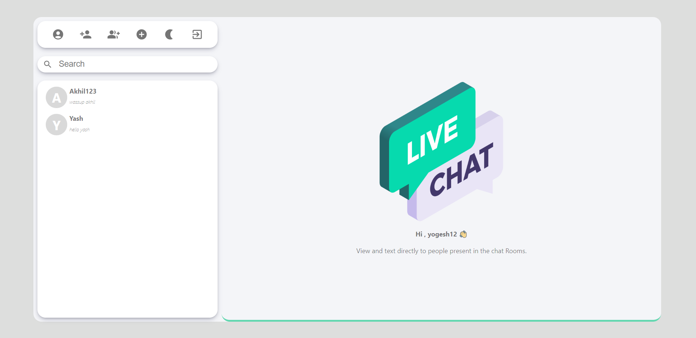
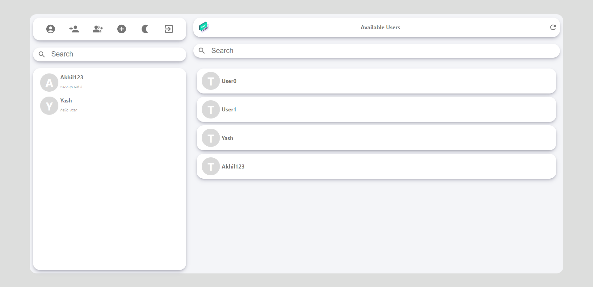
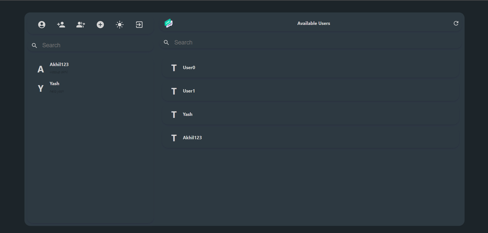
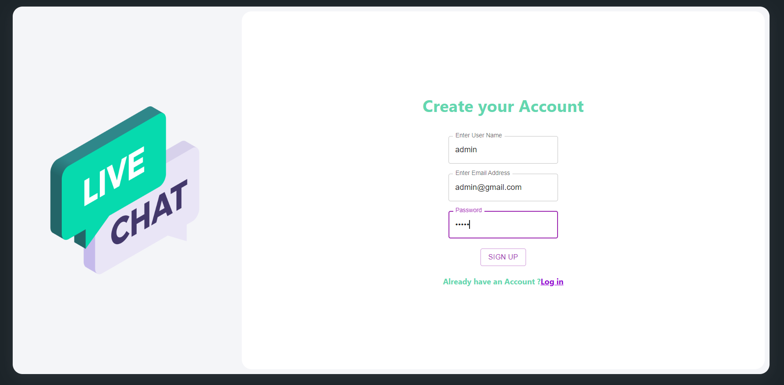

# UChat

UChat is a live chat application that allows users to create groups, add new users and interact in real time with the help of socket.io. It also has a dark mode feature for a better user experience.

## Features

- Token authentication
- Login and signup
- Creating group
- Adding user
- Dark mode

## Tech Stack

- React JS
- Express JS
- Node JS
- MongoDB
- Material UI

## Installation

To run this project, you need to have Node.js and MongoDB installed on your system.

1. Clone this repository: `git clone https://github.com/username/UChat.git`
2. Go to the project directory: `cd UChat`
3. Install the dependencies: `npm install`
4. Start the server: `npm start`
5. Open another terminal and go to the client directory: `cd client`
6. Install the dependencies: `npm install`
7. Start the client: `npm start`
8. Open http://localhost:3000 to view the application in the browser.

## UChat

